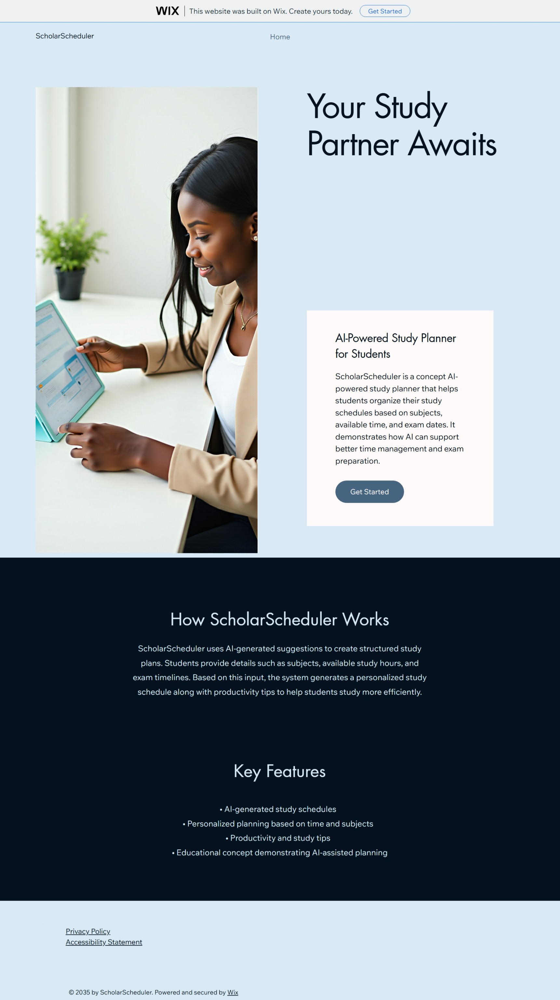

# FUTURE_PE_02 – AI-Powered Website using Wix AI

## Task Description
This project was created as part of the Future Interns Prompt Engineering Internship (Task 2).
The objective was to build an AI-powered website using Wix AI to demonstrate AI-assisted website creation.

## Website Link
https://gayathrimcbe.wixsite.com/scholarscheduler

## AI Features Used
- Wix AI website builder
- AI-generated content sections
- AI-assisted layout and design suggestions

## Website Sections
- Hero Section
- How ScholarScheduler Works
- Key Features
- Footer (Privacy Policy & Accessibility Statement)

## Tools Used
- Wix AI
## Website Preview

## Screenshots
A screenshot of the final website is available in the `screenshots/` folder.

## Notes
This project is created as part of the Future Interns Prompt Engineering Task 2.
No custom code was used; the focus is on prompt design and AI-assisted creation.
